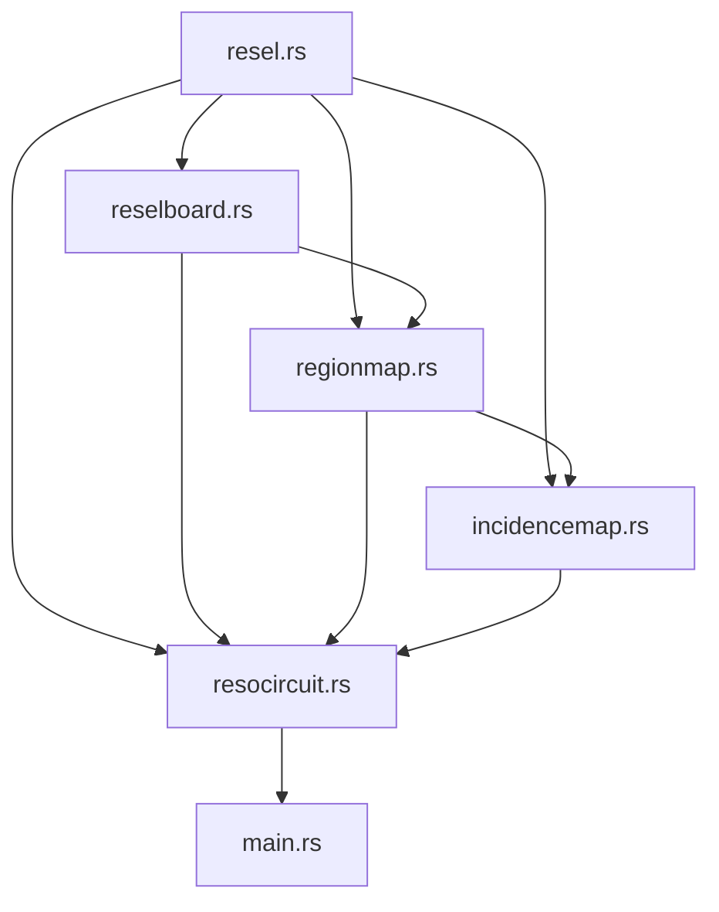
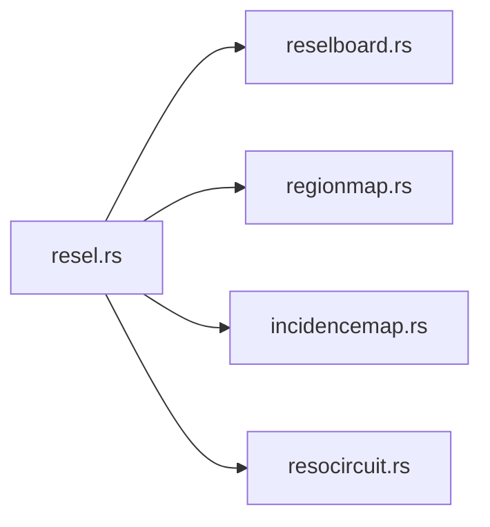
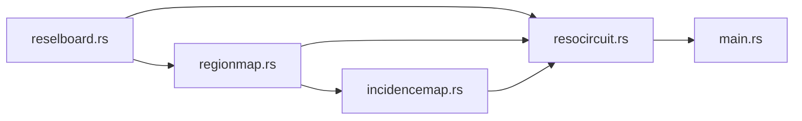

ARCHITECTURE and RESO CONCEPTS
===

You don't need to know any of this unless you are working on the code! If you are, you might benefit from the below.

Here is a graph of dependencies:



But everything depends on `resel.rs`, so let's break this into two graphs to make it look better:






(todo: check this is true after i implement `resocircuit.rs`, `main.rs`)


# Core ideas

| Thing | Analogous thing | Where?                 | Thing, explained |
| ----- | --------------- | ---------------------- | ---------------- |
| Resel | Pixel           | `resel.rs` | Class that a circuit region can take on. (See the palette!) |
| ReselBoard | Image      | `reselboard.rs` | Just a grid `Vec<Vec<Resel>>` + supporting code. |
| RegionMap  | Select-by-color; nodes in a graph | `regionmap.rs` | Identifies the regions (nodes) in a Resel circuit. |
| Node / Region | Node in a graph | | Contiguous regions of resels form the logic circuit elements.
| IncidenceMap | Edges in a graph | `incidencemap.rs` | Circuits are graphs, and an incidence map is like an adjacency map, but it fits this use case better. |
| ResoCircuit | A logic graph | `resocircuit.rs` | The executable logic graph! (todo)

Reso is a toy for simulating logic circuits defined by pixel art. It does so by compiling regions of pixels into their corresponding logical elements, and compiling a logic graph from adjacent regions of pixels. The major inspiration is Minecraft's redstone and esolangs like Piet.

# Simulation algorithm summary

The logic graph is an undirected graph of nodes of the following elements.

In each iteration, 
1. **Wires carry bools:** Wires carry a boolean state, visually represented on the graph between iterations.
2. **Input collect wire states:** Input nodes collect the state of all adjacent wire nodes into a boolean vector, i.e. $\{0,1\}^*$.
3. **Logic nodes hold one bool:** The two logic nodes (`AND` and `XOR`) calculate a single boolean based on the booleans of all adjacent input nodes.
4. **Outputs OR over adjacent input, logic nodes:** The output nodes calculate the logical OR of all the bits stored in all adjacent input and logic nodes. An input node connected directly to an output node is equivalent to an "OR" gate.
5. **Wires updated at the end of each loop:** At the end of each simulation loop, the wires are updated with the values from adjacent output nodes. The state of the input, logic, and output nodes are temporary and are only used when calculating the iteration.

In this implementation, the logic graph of a Reso circuit is compiled from 2D  bitmap images. There is no reason a Reso circuit could not be defined by, say, a 3D bitmap, or a bitmap of ASCII characters, or an SVG, etc. 

# Compilation algorithm summary

1. A bitmap image is created as input
2. The bitmap image is converted pixel-per-pixel to a `ReselBoard: Vec<Vec<Resel>>`, where a `Resel` is an enum of one of the eleven Resel classes. (Six classes for wires, AND, XOR, input, output, and "empty".)
  - Six classes for wires `WireOrangeOff`, `WireOrangeOn`, `WireSapphireOff`, `WireSapphireOn`, `WireLimeOff`, `WireLimeOn`.
  - Four classes for `AND`, `XOR`, `Input`, `Output`.
  - One class for `Empty`, to which all other colors map.
3. Contiguous regions are calculated and given a region index `i`.
  - Wires are handled in a special way: Wires can be contiguous diagonally as well as orthogonally, and adjacent wire resels of the same color but different state (say, `WireLimeOff` and `WireLimeOn`) are considered the same region. (See `is_resel_same_class`
  - This data is stored in two mappings, `region_by_resel[x][y]->i` and  `resels_by_region[i]->[(x,y), ...]`.
  - Each region represents a node. See `regionmap.rs` for more info.
4. Adjacency between regions are calculated to form the logic graph.
5. This data is used by the Reso Circuit when simulating the circuit. 


## Connected-Component Labeling with per-class neighborhood convolutions

The RegionMapper uses an algorithm called "Connected-Component Labeling".

This algorithm is used when pre-processing an image to be compiled to a Reso Circuit. I discovered it on my own when implementing this in 2018, but found its name in 2023.

The typical preprocessing pipeline is like this:

1. Load an image and convert it to a `Vec<Vec<Resel>>`
2. Identify contiguous regions of Resels. (We are here- CCL.)
3. Compile the Reso circuit graph from the adjacent regions.

There are a few particulars to our implementation:

1. "On" and "off" wires belong to the same region. We use `resel.same(other_resel)` instead of `resel == other_resel`.
  - E.g. `Resel::WireOrangeOff != Resel::WireOrangeOn`, but `Resel::WireOrangeOff.same(Resel::WireOrangeOn)`
2. Wire regions are 8-connected (orthogonally + diagonally), but all other regions are 4-connected (orthogonally).
3. We also want to maintain lists of region indices per class.
  - E.g. With 5 regions, we might have something like `wires = [1, 3]`, `ands = [2,]`, `inputs = [0,]`, `outputs = [4,]`.
4. The algorithm maintains a `visited: Vec<Vec<bool>>` to keep track of which pixels were and were not visited.
5. The algorithm outputs a `region_map: Vec<Vec<usize>>`, where `0` represents `Resel::Empty`. So, region indices start at 1.

Here is the pseudocode for the region mapping algorithm. This might not be kept up to date; refer to `reselboard.rs`.

```
width, height = board.width, board.height
visited = (width, height) * False
region_idx = 0
region_to_xy = [[]]
xy_to_region = (width, height) * 0


for (x,y) in (width, height):
  if not visited[x][y]:
  
    if board[x][y] is empty:
      visited[x][y] = True
      region_to_xy[0].push((x,y))

    else:
      color = board[x][y]
      region_idx += 1
      region_to_xy.push([])

      neighbors = new queue()
      neighbors.push((x,y))

      while neighbors is not empty:
        x, y = neighbors.pop()
        xy_to_region[x][y] = region_idx
        region_to_xys[region_idx].push((x,y))

        for (nx, ny) in each neighbor:
          if board[x][y] == color & not visited[x][y]:
            neighbors.push((nx, ny))
            visited[nx][ny] = True
```

