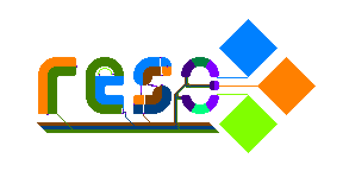

# Reso -- A visual logic circuit design language



Reso is a visual circuit design language, meant to let anybody who can draw pixel art create executable logic circuits, inspired by Redstone and Conway's Game of Life.


---


# Installation and usage

Reso is on [crates.io](https://crates.io/crates/reso) and can be installed with `cargo`:

```sh
# Compile Reso from source
cargo install reso

# Run 16 simulation steps on `reso_logo.png`, outputting to `out_xx.png`.
reso -input reso_logo.png -output out_ -numiter 16 -verbose
```

Alternatively, you can clone Reso [from GitHub](https://github.com/resolang/reso) or [from GitLab](https://gitlab.com/resolang/reso/):


```sh
# Compile Reso from source
git clone git@github.com:resolang/reso.git
cd reso

# Run 16 simulation steps on `reso_logo.png`, outputting to `out_xx.png`.
cargo run --release -- -input reso_logo.png -output out_ -numiter 16 -verbose
```

## Circuit execution

*A brief description of how programs run:* **Wires** push their signals through **input nodes**. There are three different colors of wire (orange, sapphire, and lime). Input nodes pass these signals to **logic nodes** and **output nodes**. Logic nodes are used to calculate the 'AND' or 'XOR' of every input signal, and push these on to **output nodes**. The output nodes act as one big *OR* gate, pushing the new signals out to wires.

The colors of different wires don't have any significance. They exist to make it easier to wire on the 2D torus, and to make it easier to keep track of the meaning of wires.
